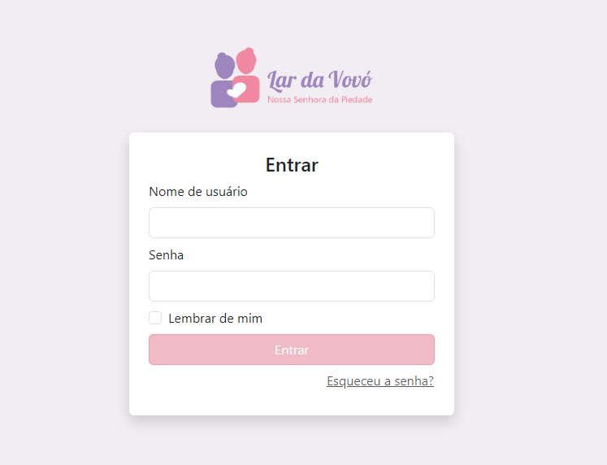
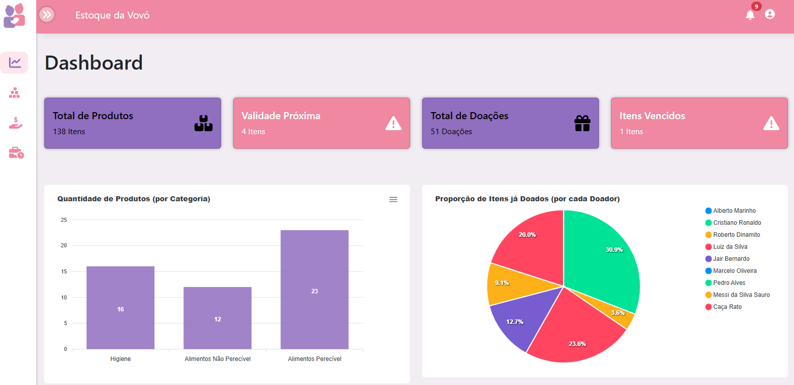
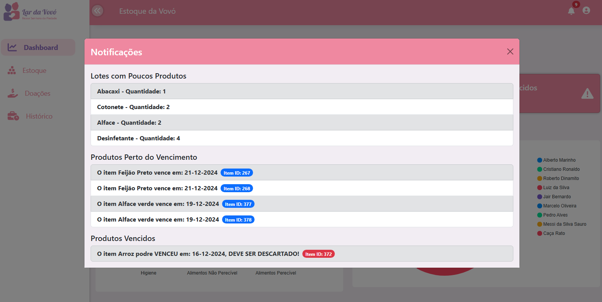
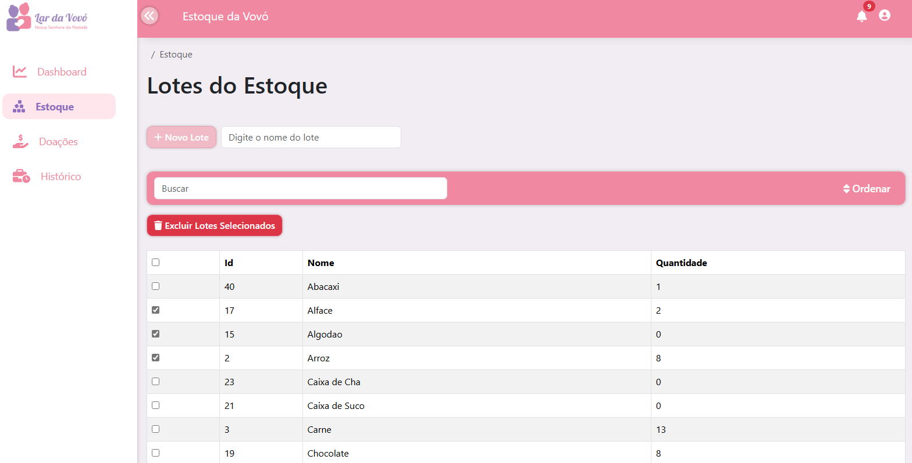
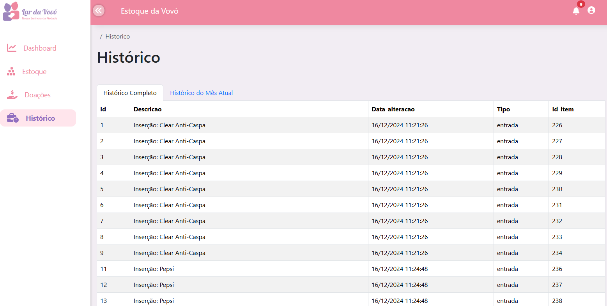

# 📦 Estoque da Vovó – Projeto de Sustentabilidade Acadêmico

## 📌 Resumo do Projeto

O **Estoque da Vovó** é um sistema web desenvolvido para auxiliar na gestão de estoque de uma instituição de apoio social de idosos, permitindo o **controle de entrada e saída de produtos**, o **cadastro de itens**, a **visualização de relatórios**, **organização eficiente dos recursos** e o **gerenciamento de doadores**.

O objetivo principal foi criar uma aplicação **intuitiva, funcional e acessível**, que pudesse ser utilizada facilmente pelos administradores da instituição, otimizando processos e reduzindo desperdícios.

O projeto foi desenvolvido como parte de um **trabalho acadêmico de sustentabilidade** na PUC Minas, em equipe, aplicando práticas de levantamento de requisitos, arquitetura de software, desenvolvimento front-end e back-end, além de testes e documentação.

---

## 👨‍💻 Minhas Contribuições no Projeto

Durante o desenvolvimento, atuei em várias frentes com foco principal no **front-end** e na **integração com a API**. Minhas atividades incluíram:

* Elaboração do projeto e contato com o cliente.
* Definição de problemas, objetivos e escopo do trabalho.
* Levantamento de requisitos.
* Proposição e definição dos mecanismos arquiteturais do sistema.
* Modelagem e criação de diagramas arquiteturais (Modelo C4).
* Criação das interfaces (UX/UI) e prototipagem das telas.
* Desenvolvimento e estruturação de todo o front-end e sua integração com a API.
* Apoio em partes específicas do back-end para garantir o funcionamento e integração do sistema.
* Testes manuais de integração front-end ↔ API e correções de bugs identificados.
* Elaboração do tutorial de uso do sistema para o cliente, garantindo que todos os recursos fossem facilmente compreendidos.

---

## 🛠️ Tecnologias Utilizadas

* **Front-end:** React.js, Vite, Axios, Bootstrap, React Router
* **Back-end:** Node.js, Express, PostgreSQL, Sequelize

---

## 🖼️ Demonstrações do Sistema

1. Tela de login

2. Tela principal do estoque

3. Tela de notificações

4. Tela do estoque

5. Tela doadores 

6. Tela Histórico

---

## 📚 Competências Desenvolvidas

* Comunicação com stakeholders e coleta de requisitos.
* Desenvolvimento front-end para aplicações web e integração com APIs REST.
* Desenvolvimento back-end
* Aplicação de conceitos de arquitetura de software.
* Modelagem de diagramas arquiteturais e documentação técnica.
* Trabalho em equipe, versionamento e integração contínua.
* Elaboração de materiais de treinamento para usuários finais.

---

